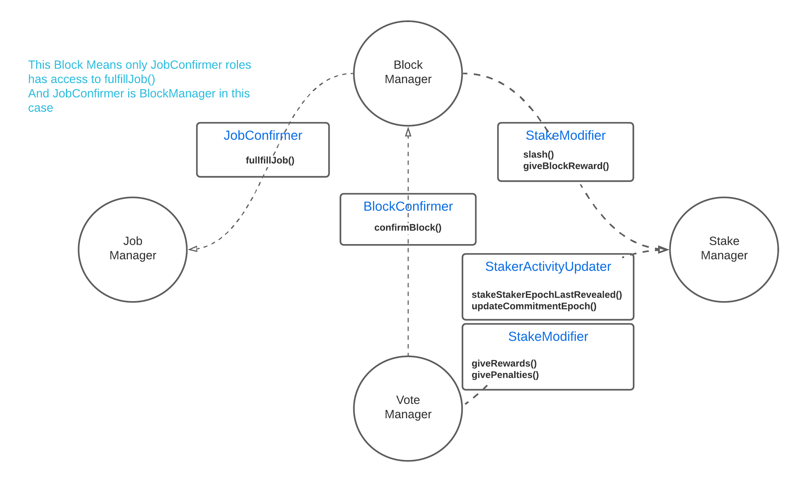

  <h3 align="center">Access Control List</h3>
  

    Access Control of Razor Network 
  

  
Index

  <ol>
    <li>
      <a href="#access-types">Access Types</a>
    </li>
    <li><a href="#functional-overview">Functional Overview</a>  </li>
    <li><a href="#roles-and-their-holders">Roles and their holders</a></li>

 
  </ol>

### :small_blue_diamond: Access Types 

| Type            | Access                                                                                                    |
| :-------------- | :-------------------------------------------------------------------------------------------------------- |
| Node            | Anyone, Not differentiated on msg.sender                                                                  |
| Particular Node | Anyone, Differentiated on msg.sender                                                                      |
| Client          | Anyone                                                                                                    |
| Internal        | Only Parent and Inherited contract                                                                        |
| Role Wise       | Specific Role, grantable/revocable by Admin through ACL.sol                                               |
|                 | <ol><li>JobConfirmer</li><li>BlockConfirmer</li><li>StakeModifier</li><li>StakerActivityUpdater</li></ol> |

 

### :small_blue_diamond: Functional Overview

#### JobManager.sol

| Function   | Access       | Comments |
| :--------- | :----------- | :------- |
| createJob  | Client       |          |
| fulfillJob | JobConfirmer |          |

#### BlockManager.sol

| Function              | Access          | Comments |
| :-------------------- | :-------------- | :------- |
| propose               | Particular Node |          |
| giveSorted            | Particular Node |          |
| resetDispute          | Particular Node |          |
| confirmBlock          | BlockConfirmer  |          |
| \_insertAppropriately | Internal        |          |

#### VoteManager.sol

| Function | Access          | Comments |
| :------- | :-------------- | :------- |
| commit   | Particular Node |          |
| reveal   | Node            |          |

#### StakeManager.sol

| Function                   | Role                  | Comments |
| :------------------------- | :-------------------- | :------- |
| setStakerEpochLastRevealed | StakerActivityUpdater |          |
| updateCommitmentEpoch      | StakerActivityUpdater |          |
| stake                      | Particular Node       |          |
| unstake                    | Particular Node       |          |
| withdraw                   | Particular Node       |          |
| givePenalties              | StakeModifier         |          |
| giveBlockReward            | StakeModifier         |          |
| giveRewards                | StakeModifier         |          |
| slash                      | StakeModifier         |          |

 

### :small_blue_diamond: Roles and their Holders

| ***Role***                | ***Accessible Functions***                              | ***Functions of*** | ***Role Holder*** |
| :------------------------ | :------------------------------------------------------ | :----------------- | :---------------- |
| **JobConfirmer**          | fullfillJob()                                           | JobManager         | BlockManager      |
| **BlockConfirmer**        | confirmBlock()                                          | BlockManager       | VoteManager       |
| **StakeModifier**         | slash() giveBlockReward()                            | StakeManager       | BlockManager      |
|                           | giveRewards() givePenalties()                        | StakeManager       | VoteManager       |
| **StakerActivityUpdater** | setStakerEpochLastRevealed() updateCommitmentEpoch() | StakeManager       | VoteManager       |

