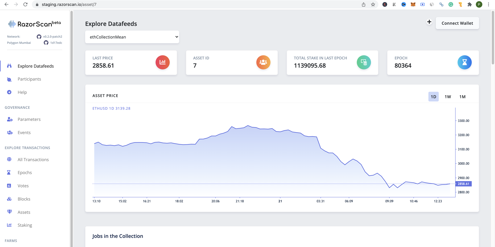
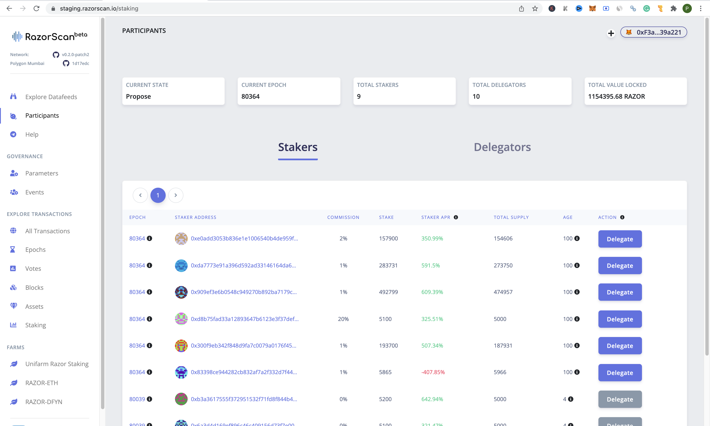
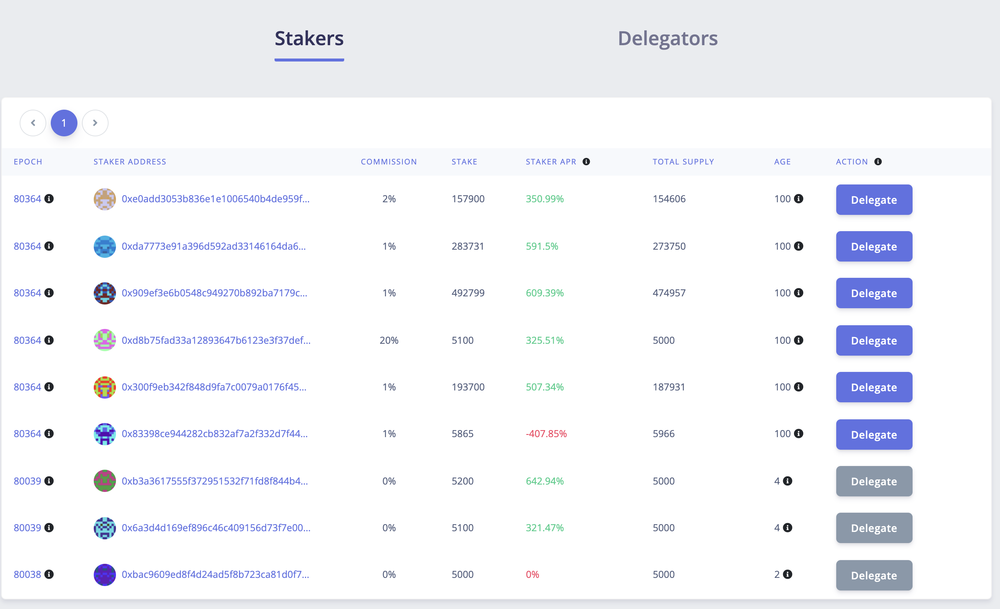
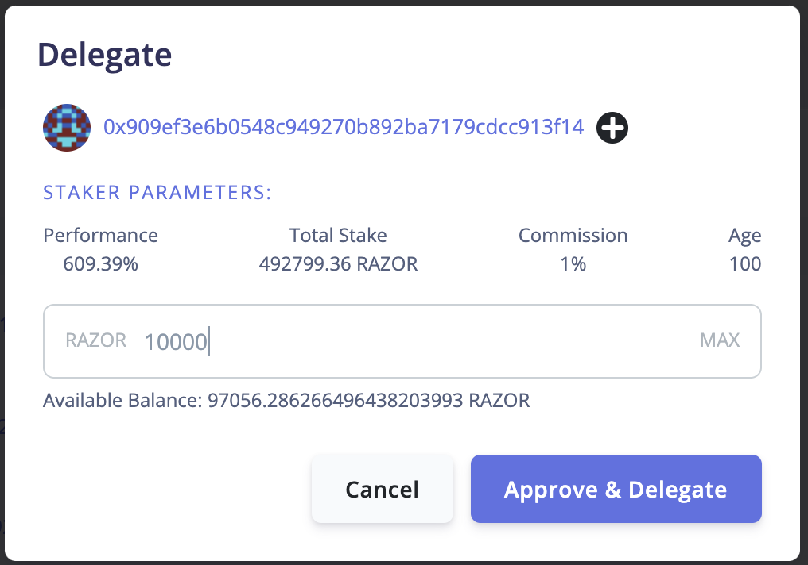
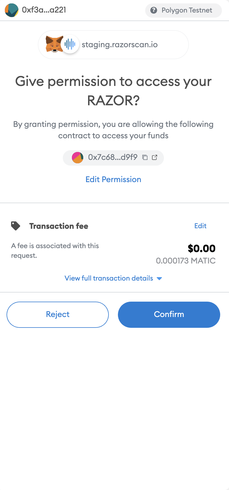
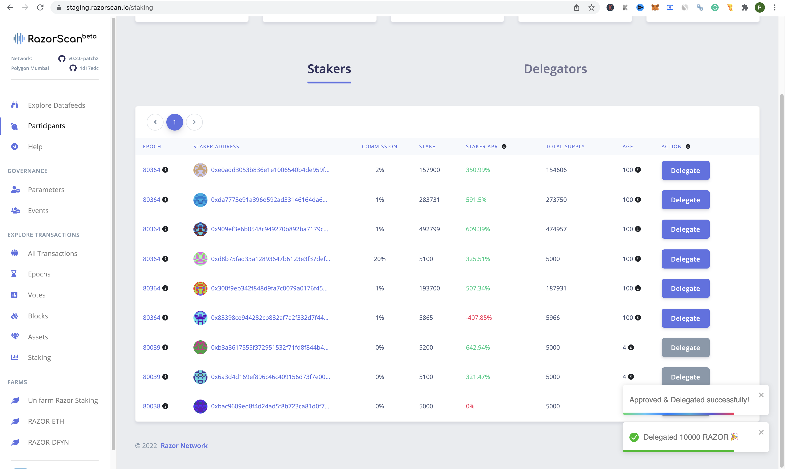
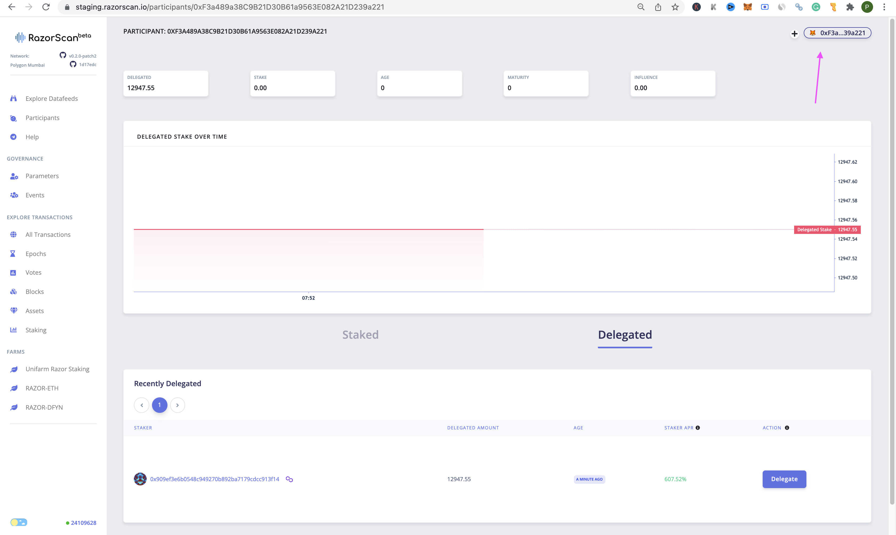

## Quick start - Delegate

Razor network is a proof of stake network. In order to participate in the network as a delegator, you will need to "Delegate" your RAZORs. RAZORs are the native tokens in the network and they are compatible with the ERC20 tokens standard.

> Warning: Razor network is in alpha state and is deployed on Matic Mumbai testnet. Please don't use assets with value.

## Metamask Setup

1. Change the Network to “Polygon Mumbai Testnet” 
2. Click on “Import Tokens” 
3. Under “Token Contract Address” input the testnet RAZOR token contract address.
4. Now your wallet must be showing the Test RAZOR in your wallet.
5. Make sure to get some test MATIC on Mumbai for gas from the faucet [here](https://faucet.polygon.technology/)

## Delegation on Razorscan

### Step 1

 Visit <https://razorscan.io/>

 **Note** : *We recommend all the Delegators to bookmark this specific URL to prevent any phishing Attacks*

### Step 2
 Now, click on “Connect Wallet” from the top right corner and make sure your network is set to “Polygon Mumbai Testnet”.

### Step 3
 Once your wallet is connected, visit [https://razorscan.io/staking](https://razorscan.io/staking) or click on “Participants” from the menu bar on the left and you should see the screen below: 

### Step 4
 Click on the “Delegate” button next to the staker of your choice to delegate your tokens to them. You can choose a staker based on activity, commission, stake, APR, age, etc.

**Note** - *Commissions here refer to the percentage of the rewards earned on your delegated funds a staker would receive/charge for including your finds in their stake.*

### Step 5
 Once you click on Delegate, you will be shown a box with more info around the staker’s performance. Input the number of tokens you want to delegate and click on “Approve & Delegate”.

### Step 7

 You will have a Metamask popup asking for approval. Verify the transaction and click on “Confirm”.

### Step 8

 Once you sign the transaction, your tokens will be delegated and you will see a small pop up on the bottom of the screen on RazorScan confirming the tokens delegated.

### Step 9

 By clicking on the Metamask icon on the RazorScan, you will be able to see your delegated stake. 

